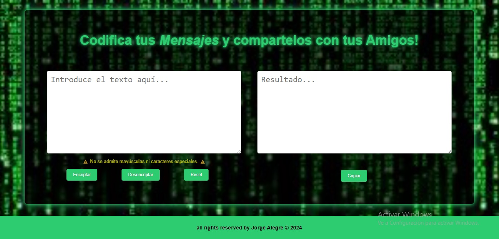

# CHALLENGER DE ONE

## Descripción

es una aplicacion de encriptado/desenceiptado de texto. Consta de un campo izquierdo (campo de entrada) donde se ingresa el texto y se puede encriptar o densencriptar mediante sus botones respectivamente, adicionalmente le agregue un boton de reset.
En el campo derecho se encuentra el (campo de salida del texto procesado) el cual se puede copiar mediante un boton copiar. 
tambien consta de un pie de pagina basico

## lenguajes utilizados

1. html
2. css
3. javascript

## Adicional

[deploy en githubpages](https://ge01ge.github.io/CHALLENGER-ONE.github.io/)

## Contacto

- **Nombre**: Alegre Jorge
- **Correo Electrónico**: [mi-email@.com](georgea080@gmail.com)
<!-- **LinkedIn**: [Tu Perfil](https://www.linkedin.com/in/tu-perfil) -->

